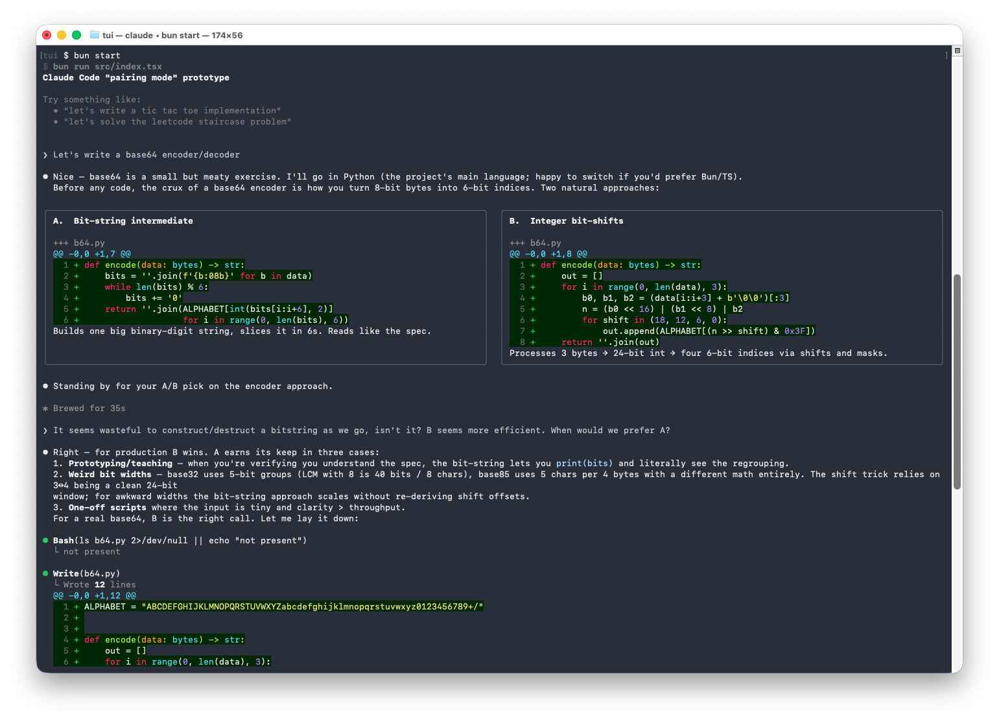

# Claude "pair programming mode"

This repository contains a prototype of a Claude Code plugin to help users learn while they code, by presenting side-by-side options at key decision points, and asking questions. See the [design rationale document](https://docs.google.com/document/d/1RXf2w8dDN_kLg49BCdubveS7BXONwBpVVQSae0SC-AM/edit?usp=sharing) and TODO [video]() for context.



## Headline results

|  | Baseline | learning-output-style | pair programming mode |
|---|---:|---:|---:|
| Question frequency | 1.06 | 1.11 | 4.17 |
| Question quality | 1.06 | 1.14 | 4.08 |
| Scaffolding | 1.31 | 1.53 | 3.97 |
| Flow and tone | 3.11 | 3.22 | 4.25 |
| Friction | 3.00 | 3.31 | 3.19 |
| Effectiveness | 3.00 | 3.03 | 3.25 |
| **Final score (0–1)** | **0.27** | **0.30** | **0.69** |

See the design doc for discussion of the eval design.

## Run it

You can run the prototype interactively with

```bash
cd tui && bun start
```

This launches a minimal clone of Claude Code with the side-by-side option tool enabled. This requires [bun](https://bun.com/docs/installation) to be installed, as well as the `claude` CLI on path (as it is invoked by the agent SDK).


## Interesting files

- [Prompt used for pairing mode](https://github.com/ozan/claude-pairing-mode/blob/main/pairing_prompt.md)
- [Grader logic](https://github.com/ozan/claude-pairing-mode/blob/main/eval/grade.py) particularly the [grader rubric prompt](https://github.com/ozan/claude-pairing-mode/blob/main/eval/grade.py#L42-L102)
- [Eval problem set](https://github.com/ozan/claude-pairing-mode/blob/main/eval/problems.json)


## Evals

A minimal eval suite was constructed to compare this feature to both a bare Claude Code baseline, as well as to Anthropic's learning-output-style plugin. The eval is also useful for iterating on the prompt. It runs a Haiku user/student and a Sonnet pair/assistant then uses Opus to grade the transcript based on a rubric.

To run the eval yourself (one condition x N problems -> one tagged run):

```bash
cd eval && uv run --env-file .env run.py --condition regular --tag my-updates -j 6
```

Flags to `run.py`:

  - --condition baseline | learning | regular
  - --tag NAME (default: timestamp; becomes the dir name under runs/)
  - -j N / --concurrency N (default 1)
  - -n N / --num N (first N problems only; default: all 36)
  - --problem-ids slug1,slug2 (specific problems instead)
  - --max-turns N (default 50)
  - --tutor-model / --student-model (defaults: sonnet-4-6 / haiku-4-5)
  - --dry-run (print plan, don't execute)

This generates transcripts (both machine and human readable) in the eval/runs directory.

To then grade a run:

```bash
cd eval && uv run --env-file .env grade.py runs/initial --baseline runs/baseline
```
                                                         
Flags to `grade.py`

  - --baseline DIR (productivity criteria graded against this; omit for absolute scoring)
  - -j N (default 4; concurrency for grading API calls)
  - --only SLUG (re-grade just one — note: also rewrites grades_summary.json, so re-run the full grade after to restore the aggregate)
  - -f / --force (re-grade even if grade.json already exists)

Both evaluation and grading requires an `ANTHROPIC_API_KEY` in .env for the Haiku user and Opus grader respectively (the Sonnet pair/assistant runs via the agent SDK).

Eval transcripts and grades can be reviewed most easily via the generated html viewer:

```bash
open eval_viewer.html
```

This can also be regenerated if you do another eval run:

```bash
cd eval && uv run generate_viewer.py
```


